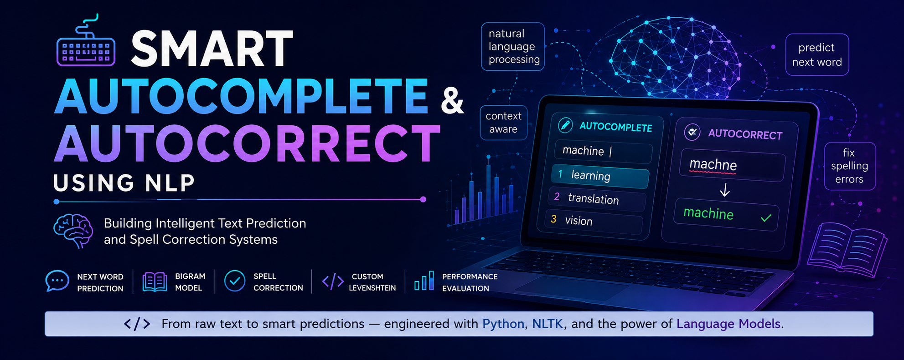

<div align="center">

# ⌨️ Smart Autocomplete & Autocorrect using NLP

### Building a Frequency-Based Language Model from Scratch




---

*"Teaching machines to predict what we type—and fix what we mistype."*

</div>

---

# Overview

This project demonstrates the implementation of two fundamental Natural Language Processing (NLP) applications:

- ✨ **Autocomplete**
- 📝 **Autocorrect**

using classical NLP techniques instead of modern transformer models.

The system learns from a **large Wikipedia text corpus** and predicts probable next words using a **Bigram Language Model**. It also performs spelling correction using both **PySpellChecker** and a **custom implementation of the Levenshtein Distance algorithm**.

---

# Project Workflow

```
Wikipedia Corpus
        │
        ▼
 Text Preprocessing
        │
        ▼
 Tokenization
 Lowercasing
 Stopword Removal
 Punctuation Removal
        │
 ┌──────┴────────┐
 ▼               ▼
Autocomplete   Autocorrect
(Bigram)      (SpellChecker + Levenshtein)
        │
        ▼
 Performance Evaluation
        │
        ▼
 Precision • Recall • Accuracy
```

---

# Features

✔ NLP Text Preprocessing

✔ Frequency-based Bigram Language Model

✔ Next Word Prediction

✔ Top-3 Autocomplete Suggestions

✔ Edit Distance Based Spell Correction

✔ Custom Levenshtein Algorithm

✔ PySpellChecker Integration

✔ Performance Evaluation

✔ Algorithm Comparison

✔ Visualization using Matplotlib

---

# Dataset

The project uses the **Wikipedia Text Corpus** containing millions of words.

Due to GitHub's file size limitations, the dataset is **not included** in this repository.

Download it from Kaggle:

> https://www.kaggle.com/datasets/kirauser/wikipedia-dataset

---

# Technologies Used

| Category | Tools |
|-----------|-------|
| Programming | Python |
| NLP | NLTK |
| Spell Correction | PySpellChecker |
| Data Handling | Pandas |
| Visualization | Matplotlib |
| Evaluation | Scikit-learn |

---

# Autocomplete

The autocomplete module uses a **frequency-based Bigram Language Model**.

Example:

```
Input

machine

↓

Top Predictions

learning
translation
vision
```

---

# Autocorrect

Two different approaches were implemented.

### Method 1

PySpellChecker

### Method 2

Custom Levenshtein Distance

Example

```
machne

↓

machine
```

---

# Results

| Model | Accuracy |
|---------|----------|
| PySpellChecker | 95% |
| Custom Levenshtein | 65% |

---

# Future Improvements

- Transformer Language Models
- FastAPI Backend
- Trie-based Prefix Search
- Context-Aware Prediction
- Personalized Suggestions
- Real-time Keyboard API
- Multilingual Support

---

# Learning Outcomes

This project demonstrates practical implementation of:

- Natural Language Processing
- Language Modeling
- Bigram Models
- Text Preprocessing
- Edit Distance Algorithms
- Spell Correction
- Performance Evaluation

---

# Author

**Bhavyaa Bansal**

Data Analyst Intern

Oasis Infobyte

---

<div align="center">

⭐ If you found this project useful, consider giving it a star.

</div>