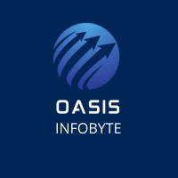
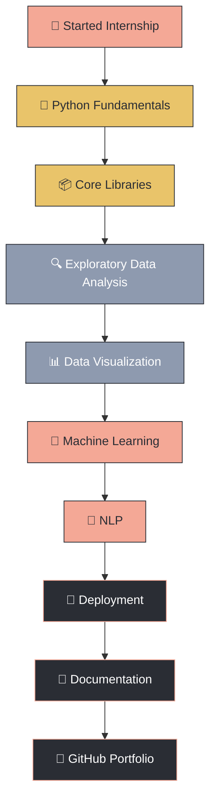

<div align="center">


<br/>

<a href="#">
  
</a>

<br/><br/>


</div>

<br/>

<!-- ═══════════════════════════════ ORGANIZATION ═══════════════════════════════ -->

<div align="center">

### 🤝 In Association With



**Oasis Infobyte — Data Analytics Internship Program**

*Grateful for the mentorship, structure, and real-world exposure this internship provided —*
*every task in this repository reflects that learning experience.*

</div>

<div align="center">
  
</div>

<br/>

<div align="center">
  
</div>

<br/>

<!-- ═══════════════════════════════ ABOUT ═══════════════════════════════ -->

## 📖 About This Repository

<table>
<tr>
<td>

This repository is the **complete archive of my Data Analytics Internship** at **Oasis Infobyte** — a single, organized home for every task, notebook, dataset, and report produced during the program.

Rather than a scattered set of files, this is a **structured learning record**, spanning:

<div align="center">

| 🧹 Data Cleaning | 📊 EDA | 🤖 Machine Learning | 🧠 NLP |
|:---:|:---:|:---:|:---:|
| 📈 Visualization | 🖥️ Dashboards | 🧩 Classification & Regression | 📄 Reports & Docs |

</div>

> **Philosophy:** Every task here favors *practical implementation over theory* — real datasets, real problems, real conclusions.

</td>
</tr>
</table>

<br/>

<!-- ═══════════════════════════════ OBJECTIVES ═══════════════════════════════ -->

## 🎯 Repository Objectives

<table>
<tr>
<td width="33%" align="center">

### 📚 Learning
Applying core data analytics and ML concepts to real datasets

</td>
<td width="33%" align="center">

### 🧩 Problem Solving
Translating ambiguous problems into structured analytical solutions

</td>
<td width="33%" align="center">

### 💼 Portfolio Building
Curating recruiter-ready, demonstrable project work

</td>
</tr>
<tr>
<td width="33%" align="center">

### 📝 Documentation
Writing clear, reproducible project write-ups

</td>
<td width="33%" align="center">

### 🏢 Industry Readiness
Following professional workflows and coding standards

</td>
<td width="33%" align="center">

### 🌍 Real-World Application
Solving problems that mirror on-the-job scenarios

</td>
</tr>
</table>

<br/>

<!-- ═══════════════════════════════ STATISTICS ═══════════════════════════════ -->

## 📊 Repository at a Glance

<div align="center">

| 🗂️ Projects | 📁 Datasets | 📄 Reports | 📈 Visualizations |
|:---:|:---:|:---:|:---:|
| `8` | `9` | `9` | `50+` |

| 🧮 Algorithms | 🤖 ML Models | 📚 Documentation |
|:---:|:---:|:---:|
| `12+` | `10+` | `100%` |

</div>

<br/>

<!-- ═══════════════════════════════ NAVIGATION ═══════════════════════════════ -->

## 🧭 Quick Navigation

<div align="center">

| Section | Description |
|---|---|
| [📖 About](#-about-this-repository) | What this repository represents |
| [🗂️ Folder Structure](#️-folder-structure) | How the repository is organized |
| [🛤️ Internship Journey](#️-internship-journey) | Timeline of skills and growth |
| [🛠️ Tech Stack](#️-tech-stack) | Tools, libraries & languages used |
| [🧠 Core Domains](#-core-domains) | Areas of analytical focus |
| [🔄 Workflow](#-standard-data-science-workflow) | The process behind every project |
| [🌱 Skills Gained](#-skills-gained) | Competencies developed |
| [🗺️ Roadmap](#️-future-roadmap) | What comes next |
| [📬 Connect](#-connect-with-me) | Get in touch |

</div>

<br/>

<!-- ═══════════════════════════════ FOLDER STRUCTURE ═══════════════════════════════ -->

## 🗂️ Folder Structure

```
oasis-infobyte-data-analytics-internship/
│
├── 📁 Task-01-[EDARetailsSales]/
│   ├── 📓 notebook.ipynb
│   ├── 📊 dataset/
│   ├── 🖼️ screenshots/
│   ├── 📄 report.pdf
│   ├── 📝 README.md
│   └── 📦 requirements.txt
│
├── 📁 Task-02- [Customer_Segmentation_Analysis]/
│   └── ...
│
├── 📁 Task-03-[Cleaning_Data]/
│   └── ...
│
├── 🎨 assets/
│   ├── banner.gif
│   ├── coding.gif
│   ├── dashboard.gif
│   ├── ai.gif
│   ├── workflow.gif
│   ├── footer.gif
│   └── oasis_logo.png
│
├── 📝 README.md
└── 📜 LICENSE
```

<br/>

<!-- ═══════════════════════════════ JOURNEY ═══════════════════════════════ -->

## 🛤️ Internship Journey

<div align="center">



</div>

<br/>

<!-- ═══════════════════════════════ TECH STACK ═══════════════════════════════ -->

## 🛠️ Tech Stack

<div align="center">

**Programming Languages**

 &nbsp;

<br/><br/>

**Libraries & Frameworks**


<br/><br/>

**Development Tools**

 &nbsp;


</div>

<br/>

<!-- ═══════════════════════════════ CORE DOMAINS ═══════════════════════════════ -->

## 🧠 Core Domains

<table align="center">
<tr>
<td align="center" width="20%">🧹<br/><b>Data Cleaning</b></td>
<td align="center" width="20%">🔍<br/><b>EDA</b></td>
<td align="center" width="20%">⚙️<br/><b>Feature Engineering</b></td>
<td align="center" width="20%">🤖<br/><b>Machine Learning</b></td>
<td align="center" width="20%">🎯<br/><b>Classification</b></td>
</tr>
<tr>
<td align="center" width="20%">📈<br/><b>Regression</b></td>
<td align="center" width="20%">🧬<br/><b>Clustering</b></td>
<td align="center" width="20%">🧠<br/><b>NLP</b></td>
<td align="center" width="20%">📊<br/><b>Visualization</b></td>
<td align="center" width="20%">🖥️<br/><b>Dashboarding</b></td>
</tr>
<tr>
<td align="center" colspan="5">📝<br/><b>Documentation</b></td>
</tr>
</table>

<br/>

<!-- ═══════════════════════════════ WORKFLOW ═══════════════════════════════ -->

## 🔄 Standard Data Science Workflow

```mermaid
flowchart LR
    A[❓ Problem] --> B[📂 Dataset]
    B --> C[🧹 Cleaning]
    C --> D[🔍 EDA]
    D --> E[📊 Visualization]
    E --> F[⚙️ Feature Engineering]
    F --> G[🤖 Model Building]
    G --> H[✅ Evaluation]
    H --> I[💡 Insights]
    I --> J[📝 Documentation]
    J --> K[🚀 Deployment]

    style A fill:#2A2D34,color:#fff
    style B fill:#8E9AAF,color:#fff
    style C fill:#8E9AAF,color:#fff
    style D fill:#E9C46A,color:#2A2D34
    style E fill:#E9C46A,color:#2A2D34
    style F fill:#F4A896,color:#2A2D34
    style G fill:#F4A896,color:#2A2D34
    style H fill:#F4A896,color:#2A2D34
    style I fill:#E9C46A,color:#2A2D34
    style J fill:#8E9AAF,color:#fff
    style K fill:#2A2D34,color:#fff
```

<div align="center">



</div>

<br/>

<!-- ═══════════════════════════════ FOLDER CONTENTS ═══════════════════════════════ -->

## 📦 What's Inside Each Project Folder

<details>
<summary><b>Click to expand — standard structure used across all tasks</b></summary>

<br/>

| Item | Description |
|---|---|
| 📓 `notebook.ipynb` | Full analysis, code, and commentary |
| 📝 `README.md` | Project-specific overview and instructions |
| 📊 `dataset/` | Raw and/or processed data used |
| 🖼️ `images/` | Visualizations and supporting graphics |
| 🤖 `models/` | Saved/trained model files (where applicable) |
| 📄 `reports/` | Final write-up / summary report |
| 📦 `requirements.txt` | Dependencies for reproducing the project |
| 💻 `src/` | Supporting scripts / source code |
| 📈 `visualizations/` | Exported charts and dashboard screenshots |

</details>

<br/>

<!-- ═══════════════════════════════ DOCUMENTATION QUALITY ═══════════════════════════════ -->

## 📝 Documentation Quality

<div align="center">

Every project in this repository follows a **consistent documentation standard**, covering:

</div>

<table align="center">
<tr>
<td width="25%" align="center">❓<br/><b>Problem Statement</b></td>
<td width="25%" align="center">🎯<br/><b>Objective</b></td>
<td width="25%" align="center">📂<br/><b>Dataset</b></td>
<td width="25%" align="center">🔍<br/><b>EDA</b></td>
</tr>
<tr>
<td width="25%" align="center">⚙️<br/><b>Feature Engineering</b></td>
<td width="25%" align="center">🤖<br/><b>Model</b></td>
<td width="25%" align="center">✅<br/><b>Evaluation</b></td>
<td width="25%" align="center">📈<br/><b>Results</b></td>
</tr>
<tr>
<td width="25%" align="center">🏁<br/><b>Conclusion</b></td>
<td width="25%" align="center" colspan="3">🚀<br/><b>Future Improvements</b></td>
</tr>
</table>

<br/>

<!-- ═══════════════════════════════ SKILLS GAINED ═══════════════════════════════ -->

## 🌱 Skills Gained

<div align="center">


<br/>


<br/>


</div>

<br/>

<!-- ═══════════════════════════════ FEATURES ═══════════════════════════════ -->

## ✅ Repository Features

- ✔️ Clean, readable, and well-commented code
- ✔️ Thoroughly documented projects with consistent structure
- ✔️ 100% open-source and free to explore
- ✔️ Rich, publication-quality visualizations
- ✔️ Practical machine learning implementations
- ✔️ Natural language processing use cases
- ✔️ Written reports for every completed task
- ✔️ Portfolio-ready presentation
- ✔️ Recruiter-friendly navigation and layout

<br/>

<!-- ═══════════════════════════════ CONNECT ═══════════════════════════════ -->

## 📬 Connect With Me

<div align="center">

<a href="https://github.com/bhavyaabansal22"></a>
<a href="https://www.linkedin.com/in/bhavyaa-bansal-0b5170334/"></a>
<a href="https://portfolio-website-theta-lemon.vercel.app/"></a>
<a href="https://mail.google.com/mail/?view=cm&fs=1&to=bhavyaabansal22@gmail.com" target="_blank">
  
</a>

</div>

<br/>

<!-- ═══════════════════════════════ FOOTER ═══════════════════════════════ -->

<div align="center">


<br/><br/>

Made with ❤️ during my Data Analytics Internship at **Oasis Infobyte**

*Turning Data into Actionable Insights.*

**Thank you for visiting — feel free to explore, star ⭐ and connect!**


</div>
